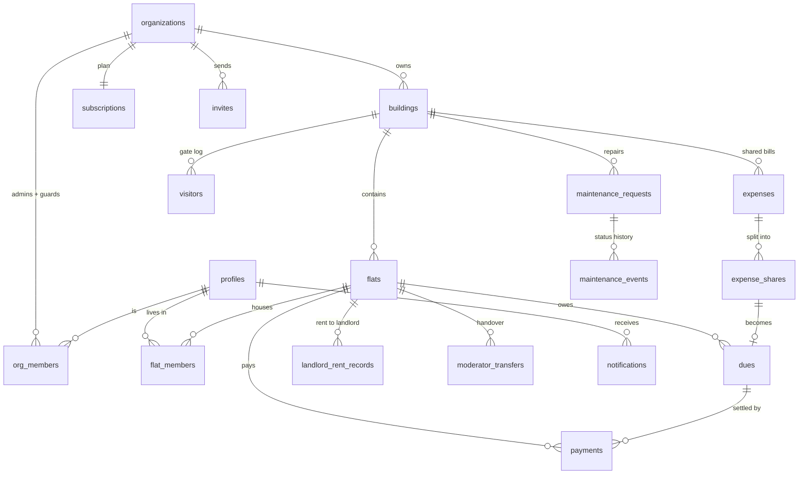

# Database

PostgreSQL on Supabase. Migrations run in filename order and are the only way the
schema changes — no edits through the dashboard.

```
supabase/migrations/
  0001_extensions_and_enums.sql   extensions, enums, updated_at + period helpers
  0002_identity.sql               profiles, organizations, org_members, subscriptions, invites
  0003_property.sql               buildings, flats, flat_members, landlord rent
  0004_money.sql                  dues, payments, expenses, expense_shares
  0005_operations.sql             visitors, maintenance, notifications, audit, transfers
  0006_indexes_and_rules.sql      indexes and the invariant triggers
  0007_rls.sql                    row level security for every table
supabase/seed.sql                 one building, four flats, a September ledger
```

Applying them locally:

```bash
psql "$DATABASE_URL" -f supabase/migrations/0001_extensions_and_enums.sql
# …in order, or:
for f in supabase/migrations/*.sql; do psql "$DATABASE_URL" -v ON_ERROR_STOP=1 -f "$f"; done
psql "$DATABASE_URL" -f supabase/seed.sql
```

On a plain Postgres instance (not Supabase) you also need a stand-in for `auth.users`
and `auth.uid()`; Supabase provides both.

## Shape



## Decisions worth knowing

**Two role tables, not one.** `org_members` holds organization-level roles (admin,
guard); `flat_members` holds flat-level roles (moderator, resident) plus that person's
rent share. A resident in one flat can be a moderator in another. `profiles.platform_role`
only matters for `super_admin`.

**Dues are per person per obligation per month.** Rent, a share of the gas bill and a
penalty are three rows, not one blended balance, so a partial payment can be applied to
the right thing and a receipt can say what it paid for. `dues.period` is always the first
day of a month.

**`dues.amount_paid` is never written by the app.** A trigger recalculates it from
confirmed payments and moves `status` between `open`, `partially_paid` and `paid`. The
only way to change a balance is to confirm or unconfirm a payment. Verified against a
live Postgres instance:

| Action | Result on the due |
| --- | --- |
| Pending payment submitted | `amount_paid` unchanged, still `open` |
| Part of the amount confirmed | `partially_paid` |
| The remainder confirmed | `paid` |
| A confirmed payment reversed | back to `partially_paid`, with the right balance |
| Billing the same month twice | one row, not two |
| Two payments given one receipt number | rejected by the unique constraint |
| `amount_paid` pushed above `amount` | rejected by `due_not_overpaid` |

**Money is `numeric(12,2)`, never float.** Taka amounts must not drift.

**Partial unique indexes carry the business rules:**

| Index | Rule |
| --- | --- |
| `flat_members_single_moderator` | one active moderator per flat |
| `flat_members_one_active_per_user` | a person joins a flat once at a time |
| `subscriptions_one_active_per_org` | one live plan per organization |
| `invites_one_pending_per_target` | one open invite per email per flat |
| `moderator_transfers_one_pending` | one handover in flight per flat |
| `visitors_active_entry_code` | entry codes unique while usable |

**Triggers hold the rules a form cannot be trusted with:** rent shares may not exceed
the flat rent, expense shares may not exceed the expense, a moderator handover needs a
24-hour gap, and every maintenance status change writes a `maintenance_events` row.

**Audit logs are append-only.** `audit_logs` has a read policy for org admins and no
insert, update or delete policy at all — only the service role writes them, through
`writeAuditLog()`.

**Soft delete via `archived_at`.** Buildings and flats are archived, never dropped;
financial history has to survive a unit being taken off the market.

## Row Level Security

Enabled on every table. Four helper functions decide access:

| Function | Returns |
| --- | --- |
| `auth_is_super_admin()` | platform staff |
| `auth_org_ids(role)` | organizations the caller belongs to |
| `auth_flat_ids(role)` | flats the caller lives in |
| `auth_managed_flat_ids()` | flats the caller moderates, plus every flat in an org they administer |

What that produces:

- A resident reads their own `dues` and `payments`, and nobody else's.
- A resident may insert a payment for their own flat, and only with `status = 'pending'`.
  Confirming is a manager action.
- A moderator reads and writes everything for their flat.
- An admin reads and writes every flat in their organization.
- A guard reads building-level visitor rows, not the ledger.
- Landlord rent records are admin-only — residents never see what the org pays the
  landlord.

Tested against these cases in the migration run; add a policy test to the Phase 15 suite
before launch.

## Regenerating types

```bash
npm run db:types    # writes src/types/database.ts from the live schema
```

Until a project exists, `src/types/database.ts` is hand-maintained and must be updated
alongside any migration.
